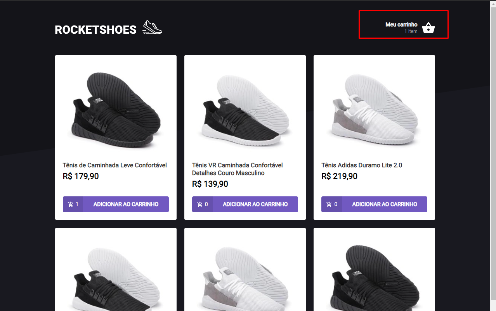

# ROCKETSHOES

<h1 align="center">
    
</h1>

[](./LEIAME.md)

## Summary

- [🧾 About](#-about)
- [🚀 Main technologies](#-main-technologies)
- [🔽 How to download the project](#-how-to-download-the-project)
- [💻 How to run the project](#-how-to-run-the-project)
- [👌 How to use the app](#-how-to-use-the-app)
  <br>

## 🧾 About

ROCKETSHOES is an e-commerce application made with ReactJS. Using it you can add or remove products in a cart and instantly see the values of the products added separately and also the total value of the cart. The cart data is saved on the localstorage of the browser so they are not lost by refreshing (or even closing) the page.
<br>

## 🚀 Main technologies

- [React](https://reactjs.org/)
- [Typescript](https://www.typescriptlang.org/)
- [Styled Components](https://styled-components.com/)
- [Axios](https://github.com/axios/axios)
- [JSON Server](https://github.com/typicode/json-server)

_(You can see all the dependencies in the [package.json](./package.json) file)_
<br>

## 🔽 How to download the project

```bash
$ git clone https://github.com/victorbadaro/ignite-challenge-cart
```

<br>

## 💻 How to run the project

The commands below use the [yarn](https://yarnpkg.com/) package manager.

```bash
# 1. Install all the project dependencies
$ yarn

# 2. Run JSON Server Fake API
yarn server

# 3. Run the app
$ yarn start

# You can also generate the files to put the app into production with:
$ yarn build

# the files will be available in the dist/ folder
```

If everything runs correctly, a message will be displayed on your terminal informing that the app code has been successfully compiled:

```bash
Compiled successfully
```

After that open your browser and access: http://localhost:3000/

✅ Nice! If you followed all the steps above correctly the project will be running locally on your machine already.
<br>

## 👌 How to use the app

- To add a product to the cart click on "ADICIONAR AO CARRINHO" (how many times you want until the product is depleted in stock - see the [server.json](./server.json) file)
  

- After adding the products to the cart, it's possible to see them in the cart by clicking on the "Meu carrinho" menu available on the top right corner of the page.
  

    

<br>

---

<p align="center">This project was created using this <a href="https://github.com/rocketseat-education/ignite-template-reactjs-criando-um-hook-de-carrinho-de-compras">template</a> and developed with ❤ by <a href="https://github.com/victorbadaro">Victor Badaró</a></p>
